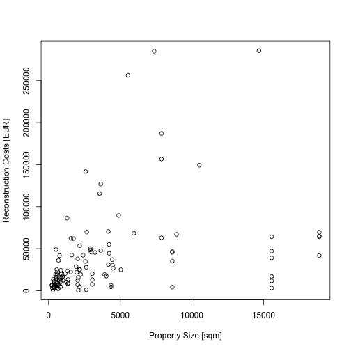

<style>
.footer {
    color: black;
    background: #E8E8E8;
    position: fixed;
    top: 90%;
    text-align:center;
    width:100%;
}

.reveal pre {
    width: 100%;
</style>


Data Products Presentation
========================================================
author: TZiegler
date: 24 April 2016
autosize: true

Introduction
========================================================

This project is the assignment for the Coursera Courser "Developing Data Products". It uses data of 119 multi-famyliy properties in central Europe. The size of the properties range from small (4 units) to large (396 units) and they were built between 184 and 17 years ago.

The Shiny App allows users to choos a property from a list. The application will reactively display:

1. Property details and summaries
2. A chart with the properties reconstruction activities and the corresponding costs


Running the Shiny App
========================================================
The Shiny App is hosted here: <https://teezed.shinyapps.io/data_products_course_project/>

The files to build the shiny app can be found here: <https://github.com/teezz/09_Data_Products_Course_Project>

The app is a starter project for analysing and predicting reconstruction costs for the real estate market.


Example Data
========================================================


```r
head(properties[,7:10])
```

```
     costs  sqm rental_units year_construction
1   632.14 2624           53              1968
2 14294.19 2624           53              1968
3    21.87 2624           53              1968
4   934.34 2624           53              1968
5  2222.95 2624           53              1968
6   448.68 2624           53              1968
```

Plot Propert Size vs Reconstruction Costs
========================================================



